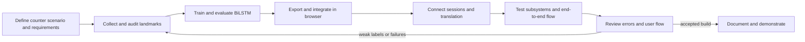
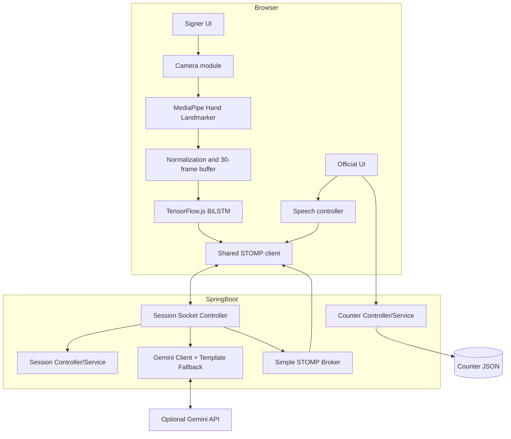

# ISL Bridge — Context Pack for Chapter 3

> Current system baseline: word-only `words_v4` model, 12 service words plus `No_Gesture`, 60% confidence threshold, Spring Boot/WebSocket backend, browser-local MediaPipe and TensorFlow.js inference. The earlier alphabet experiment is archived.

## How to use this file

Give this file to Claude together with the repository, Chapters 1 and 2, the university index/format, and any genuine project schedule or team details. Ask Claude to write **Chapter 3: Requirement Gathering, Analysis and Planning** using Sections 3.1–3.6 below.

Claude must describe the actual project. It must not invent stakeholder interviews, questionnaire results, participant counts, institutional approvals, costs, hardware, dates, team members, quotations, citations, measured latency, or deployment scale. Values marked `TO BE FILLED` require the student's real records. Proposed requirements and schedules may be presented as project planning decisions, but they must not be described as completed empirical activities unless verified.

The project is **ISL Bridge**, an academic counter-assistance prototype. A signer and a service official use synchronized browser screens. The signer's camera is processed locally through MediaPipe; a browser BiLSTM recognizes one trained service word at a time. The gloss is sent to a Spring Boot backend using STOMP over WebSocket. The backend produces English/Hindi text using Gemini when configured or deterministic offline phrases for supported inputs. Both screens receive the same conversation message.

The implemented model recognizes individual glosses. It does not provide unrestricted Indian Sign Language sentence translation, continuous fingerspelling, Marathi translation, face/body grammar, or universal signer generalization.

## Exact Chapter 3 mapping

## 3.1 Requirement Specification

### 3.1.1 Stakeholders and actors

Use these actors:

| Actor | Need or responsibility |
|---|---|
| Signer / Deaf or Hard-of-Hearing visitor | Join a service-counter session, permit camera access, perform a supported sign, read bilingual messages, and know whether camera/model/network are ready. |
| Service official | Create/reuse a counter, share its QR/code, receive the signer's translated request, and reply by typing or browser speech input. |
| System administrator/demo operator | Configure dependencies and optional Gemini key, start the application, verify diagnostics, and protect local configuration. |
| ML developer/researcher | Collect and audit landmark sequences, train/version the BiLSTM, evaluate per-class behavior, export exact weights to TensorFlow.js, and update vocabulary mappings. |
| Optional language provider | Gemini API supplies bilingual text when configured and available. It is an external service, not the sign-recognition model. |

Do not claim formal interviews or surveys were conducted unless the student supplies evidence. Safe wording: “Requirements were derived from the public-service counter scenario, accessibility needs, prototype objectives, implementation constraints, and iterative testing.”

### 3.1.2 Functional requirements

Use stable identifiers so Chapter 4/5 and test cases can refer back to them.

| ID | Functional requirement | Acceptance condition in the current prototype |
|---|---|---|
| FR-01 | The official shall create a named service counter. | `POST /api/counters` returns a persistent `CTR-XXXX` counter ID; label length is at most 80 characters. |
| FR-02 | The system shall allow a signer to start/join a counter conversation through its code or QR URL. | A valid, idle counter creates one six-character session; a second simultaneous request receives a busy conflict. |
| FR-03 | The system shall also allow creation of a temporary manual session. | `POST /api/sessions` returns a session code and the UI produces a link/QR for the other role. |
| FR-04 | The signer client shall request a front-facing camera and show actionable camera errors. | Camera uses ideal 640×480 at up to 30 FPS, audio disabled, with permission/not-found/in-use messages and a 20-second permission timeout. |
| FR-05 | The signer client shall detect up to two hands locally. | MediaPipe Hand Landmarker runs in `VIDEO` mode, tries GPU, and falls back to CPU. |
| FR-06 | The system shall transform each detected frame into the model's expected input. | Two hand slots × 21 landmarks × x/y/z = 126 values; each hand is wrist-centered and scaled by wrist-to-middle-MCP distance; missing hand slots are zeros. |
| FR-07 | The browser shall classify a rolling 30-frame sequence using the deployed BiLSTM. | TensorFlow.js loads `frontend/model/model.json`; metadata and model dimensions must agree. |
| FR-08 | The system shall apply confidence and stability gating before sending a gloss. | Confidence must be at least **0.60**, the same label must occur in two eligible prediction cycles, and inference runs every third eligible frame after the buffer is full. |
| FR-09 | The system shall suppress idle/low-confidence/repeated emissions. | `No_Gesture` is never sent to the backend; low-confidence output is not emitted; a held sign is sent once until idle/reset rearms it. |
| FR-10 | The signer shall see recognition status. | UI shows current label, confidence, inference time, camera state, recognition state, connection state, and retry controls. |
| FR-11 | The backend shall convert supported glosses into bilingual service messages. | Supported gloss produces non-empty English and Hindi through Gemini or offline phrase mapping. |
| FR-12 | Both clients shall receive the same ordered conversation. | Backend broadcasts `TRANSLATED_MESSAGE` on `/topic/session/{sessionId}` and clients reconcile against server history. |
| FR-13 | The official shall respond using typed text. | Non-empty reply of at most 1,000 characters is sent with `en-IN` or `hi-IN`. |
| FR-14 | The official shall optionally dictate a response. | Browser speech controller supports English/Hindi selection, accumulation across pauses, stop/review/send, and actionable permission/audio errors. |
| FR-15 | The backend shall preserve supported operation when Gemini is absent or fails. | Supported phrases use deterministic English/Hindi fallback and UI labels the offline phrase mode. |
| FR-16 | The system shall manage role presence and session lifecycle. | Signer/official join status is broadcast; ending removes the session, stops camera/client activity, and releases the permanent counter. |
| FR-17 | The counter shall be reusable for later visitors. | After a conversation ends or expires, the same permanent counter can start another session. |
| FR-18 | The system shall expose diagnostics. | Diagnostics verifies health, MediaPipe initialization, model load, recorded examples, idle suppression, WebSocket translation, and offers a separate physical-camera check. |
| FR-19 | The training workflow shall preserve raw recordings and version outputs. | Training reads raw JSON, refuses to overwrite an existing completed run, writes audit/evaluation artifacts, and leaves source recordings unchanged. |
| FR-20 | Model export shall verify Python/browser consistency before deployment. | Export compares probabilities on all saved held-out inputs and aborts if maximum difference exceeds `1e-4`. |

Current recognized model outputs:

- Counter
- Entrance
- Exit
- Help
- Money
- Police
- Receipt
- Security
- Ticket
- Train
- When
- Where
- No_Gesture (internal idle class; never translated)

`Hello`/`नमस्ते`/`नमस्कार` on the landing page are greeting text. `Hello` is not a trained output because only seven usable recordings were available.

### 3.1.3 Non-functional requirements

| ID | Quality requirement | Current design/verification basis |
|---|---|---|
| NFR-01 Privacy | Raw camera video shall remain on the user's device. | Frames are processed in the browser; only gloss/confidence and conversation text cross the application network. Do not claim a formal privacy audit. |
| NFR-02 Responsiveness | Recognition and status feedback should appear interactively. | Inference is local and throttled; exact live latency/FPS remains `TO BE MEASURED` on the demonstration hardware. |
| NFR-03 Reliability | Failure in camera, model, translation, or connection shall produce an actionable state. | Separate error/status UI, camera retry, model retry, reconnection, offline phrases, and history reconciliation are implemented. |
| NFR-04 Consistency | Model class order and threshold shall remain identical across training and frontend. | Versioned metadata carries 13 output classes and threshold 0.60; tests assert the deployed threshold. |
| NFR-05 Availability | Supported counter phrases should remain usable without Gemini. | Template fallback provides English/Hindi messages for current service words. |
| NFR-06 Usability | Both roles shall have focused, readable screens and clear state indicators. | Signer/official pages, bilingual message cards, QR/code flow, accessible labels, live regions, and retry controls. Formal usability scoring is `TO BE FILLED` if actually conducted. |
| NFR-07 Maintainability | Components shall be separable by responsibility. | Camera, landmarking, normalization, inference, speech, shared messaging, controllers, services, translation, training, and export use separate modules. |
| NFR-08 Reproducibility | Training/export results shall be traceable. | Seed 42, dependency versions, split manifest, data audit, trained tensors, metadata, Python predictions, and parity report are stored per run. |
| NFR-09 Security | Credentials shall remain outside frontend code and version control. | `GEMINI_API_KEY` is read from environment/local ignored `.env`; no key is sent to the browser. This prototype has no production authentication/authorization. |
| NFR-10 Portability | The demo shall run from one Windows command and standard browser. | `Start-ISLBridge.ps1` prepares assets and starts Spring Boot; Chrome/Edge recommended. Multi-device camera use requires trusted HTTPS. |
| NFR-11 Data integrity | Duplicate or malformed sequences shall not silently enter training. | Shape/finite checks, minimum tracked-frame rule, normalized-content deduplication, conflicting-hash exclusion, and non-overwriting runs. |
| NFR-12 Honest evaluation | Development results shall not be presented as universal accuracy. | Current split lacks signer IDs and was inspected during development; report it as a development holdout. |

### 3.1.4 Data and interface requirements

- Raw sequence JSON contains `sequences`; each accepted `frames` value must be exactly `30 × 126` finite numbers.
- Label text is canonicalized; the sequence label is authoritative, not the folder name.
- Training excludes one-character alphabet labels by default.
- Clips with fewer than 15 frames containing a detected hand are rejected.
- Blank leading/trailing gaps are trimmed and observed poses are interpolated to 30 frames.
- Current usable unique data: 331 sequences; 233 train, 49 validation, 49 test.
- Current output metadata: 13 classes, `[30,126]` input, 0.60 confidence threshold.
- REST exchanges JSON; live messaging uses STOMP over `/ws` with application prefix `/app` and broker prefix `/topic`.
- Session IDs are six alphanumeric characters; counter IDs have form `CTR-XXXX` using characters chosen to avoid ambiguous glyphs.

### 3.1.5 Constraints and assumptions

- Camera access needs `localhost` or trusted HTTPS.
- Browser must support `getUserMedia`; speech input depends on browser speech-recognition support.
- Gemini is optional for supported phrases and required for broader bilingual generation.
- Current landmark representation omits face, body pose, and absolute wrist position.
- The prototype processes individual signs, not continuous ISL sentences.
- Dataset lacks participant/session identifiers, so current evaluation is not signer-independent.
- Runtime conversation history is in memory; permanent counter definitions are stored locally as JSON.
- The same origin serves frontend and backend in the supported launcher flow.
- Hardware details and measured latency are `TO BE FILLED` from the real demonstration machine.

### 3.1.6 Requirement traceability

Claude should include a compact traceability table. Suggested entries:

| Requirement | Main implementation | Verification |
|---|---|---|
| FR-04–FR-06 | `camera.js`, `landmarker.js`, `normalize.js` | Camera/tracking diagnostic and normalization unit test |
| FR-07–FR-10 | `inference.js`, `signer.js`, model metadata | Model test, rolling stable-emission test, 60% threshold assertion |
| FR-11–FR-17 | Spring controllers/services, `shared.js`, `official.js` | 15 Java tests and end-to-end integration test |
| FR-18 | `diagnostics.html`, `diagnostics.js` | Manual diagnostic run plus automated model/backend path |
| FR-19–FR-20 | training/export scripts | Data audit, split uniqueness test, Python/TF.js parity report |
| NFR-01 | browser camera/landmark pipeline | Source inspection; network payload contains gloss/text, not frames |
| NFR-05 | `TemplateFallbackAgent` | Expanded vocabulary tests and integration run |
| NFR-08 | `saved_model/words_v4` artifacts | Metadata/report/manifest/verification presence |

## 3.2 Feasibility Study

### 3.2.1 Technical feasibility

Explain why the prototype is technically feasible:

- Modern browsers can capture camera video and execute MediaPipe/TensorFlow.js locally.
- Hand landmarks reduce a full image to 126 numeric features per frame, making the model small enough for browser inference.
- A two-layer BiLSTM models motion over 30 frames and can be exported as a TensorFlow.js Layers model.
- Spring Boot supports REST, WebSocket/STOMP messaging, scheduling, static resource serving, and JSON handling in one application.
- Gemini integration is optional because deterministic fallback supports the demo vocabulary.
- The working build, automated checks, model export parity, and end-to-end integration establish implementation feasibility.

Technical limitations affecting feasibility:

- Recognition quality depends on dataset quality, lighting, framing, tracking, and signer variation.
- The current 331 usable sequences are small, and some classes have 12–20 total examples.
- Hand-relative features cannot model non-manual ISL grammar or signs distinguished by body/face/location.
- Multi-device use needs HTTPS and network accessibility.
- The model achieved 79.59% top-1 accuracy on the 49-example development holdout; this does not establish unseen-signer performance.

### 3.2.2 Operational feasibility

- The official workflow resembles a service-counter process: create counter once, display QR/code, receive one visitor at a time, reply, end, and reuse.
- The signer gets separate camera, recognition, and connection statuses instead of one generic loading state.
- Both users read the same synchronized messages, reducing ambiguity.
- Supported phrases continue without an external translation provider.
- A one-machine faculty demonstration is straightforward; production operation would need HTTPS hosting, device/network administration, authentication, and user studies.
- Operational acceptance with actual Deaf signers is `TO BE FILLED`; do not claim it occurred without evidence.

### 3.2.3 Economic feasibility

Use qualitative analysis unless real costs are provided:

- Core frameworks/libraries are open-source.
- Development can use an existing laptop, webcam, browser, Java, Node.js, and Python.
- Local inference avoids a dedicated GPU inference server for the prototype.
- Optional costs include Gemini usage, HTTPS/domain/cloud hosting, better camera/lighting, data collection, ISL expert validation, and maintenance.
- Actual budget, API consumption, labor cost, and hosting quote: `TO BE FILLED`.
- Do not call the system “free”; say that the local prototype has low incremental infrastructure cost when existing hardware is available.

### 3.2.4 Schedule feasibility

- The project was decomposed into dataset capture/audit, model training, browser integration, backend/session flow, translation, UI, testing, and documentation.
- Versioned outputs and offline fallback reduce last-minute dependency risk.
- Weak classes require iterative recollection; the 48-hour plan prioritizes Help, Security, When, and No_Gesture before adding Platform, Toilet, Water, Yes, No, and Repeat.
- Actual project start/end dates and milestone dates: `TO BE FILLED`.

### 3.2.5 Legal, ethical, privacy and social feasibility

- Obtain informed consent for any identifiable recording and document permitted use/retention.
- Store anonymous participant/session IDs rather than names in dataset metadata.
- Verify intended signs with fluent ISL signers/experts and acknowledge the official ISLRTC dictionary where used.
- Do not treat one English word as automatically equivalent to every contextual ISL use.
- Camera frames are designed to stay on-device, but a production privacy/security review has not been conducted.
- Gemini receives gloss/text and conversation context when enabled; the report should disclose this external processing.
- The system assists communication and does not replace qualified interpreters for legal, medical, emergency, or other high-stakes situations.
- Ethics approval/consent form number, if applicable: `TO BE FILLED`.

### 3.2.6 Feasibility conclusion

Recommended conclusion: the system is feasible as an academic proof of concept and controlled counter demonstration using existing hardware and a constrained vocabulary. Wider deployment depends on signer-diverse data, formal accessibility/usability work, HTTPS/security, monitoring, language validation, and production operations.

## 3.3 Methodology

### 3.3.1 Development methodology

Describe the project as an **iterative and incremental prototyping methodology**:

1. Define the narrow public-service counter problem and two user roles.
2. Establish a camera-to-landmark recording/inference pipeline.
3. Collect and audit fixed-length landmark sequences.
4. Train a baseline BiLSTM and inspect class-level errors.
5. Integrate browser inference with the signer UI.
6. Implement counter/session lifecycle and real-time synchronization.
7. Add bilingual translation and offline phrases.
8. Test subsystems and the complete pipeline.
9. Archive superseded experiments, retrain the word-only model, and update documentation.
10. Use weak-class results to plan the next data-collection iteration.

Explain why this process model fits: ML uncertainty and browser/device behavior require repeated data/model/interface feedback. A single linear waterfall pass would not reveal duplicate recordings, weak idle behavior, export incompatibility, camera-permission issues, or WebSocket lifecycle problems early enough.

### 3.3.2 Requirement-gathering methodology

Verified sources:

- Project objectives and railway/public-service counter scenario.
- Inspection of actual user flows and failure states.
- Dataset audit and model evaluation artifacts.
- Compatibility requirements from browser camera, MediaPipe, TensorFlow.js, Spring Boot, WebSocket, and optional Gemini integration.
- Iterative automated and manual diagnostics.

Possible activities may only be listed as future work unless evidence exists: Deaf-community interviews, observation studies, structured questionnaires, SUS usability studies, expert sign validation workshops, or production counter pilots.

### 3.3.3 ML/data methodology

1. Read all JSON sequences recursively from `model-training/dataset/raw`.
2. Canonicalize labels and exclude alphabet labels by default.
3. Validate shape `(30,126)` and finite values.
4. Reject fewer than 15 tracked-hand frames.
5. Trim blank temporal boundaries and interpolate observed landmarks to 30 positions.
6. Normalize each hand around its wrist and wrist-to-middle-MCP scale.
7. Deduplicate by SHA-256 of rounded normalized tensors and remove conflicting hashes.
8. Exclude classes with fewer than 12 unique usable samples; therefore Hello is excluded.
9. Split chronologically within each class into train/validation/test. State clearly that this is not signer-independent.
10. Apply Gaussian noise and small in-plane rotations only to training examples, preserving missing-hand masks.
11. Train the BiLSTM with seed 42, Adam, sparse categorical cross-entropy, inverse-frequency class weights, early stopping, and learning-rate reduction.
12. Evaluate once on the saved development test split and report per-class precision, recall and F1.
13. Export raw trained tensors into a matching TensorFlow.js topology.
14. Compare Python and TensorFlow.js probabilities before deployment.

Current values:

| Item | Value |
|---|---:|
| Unique usable sequences | 331 |
| Train / validation / test | 233 / 49 / 49 |
| Classes | 13 total: 12 service words + idle |
| Input | 30 × 126 |
| Training seed | 42 |
| Batch size | 32 |
| Initial learning rate | 0.001 |
| Dropout | 0.30 after each BiLSTM |
| Runtime confidence threshold | 0.60 |
| Required stable predictions | 2 |
| Inference cadence | Every third eligible frame |

### 3.3.4 Software methodology and validation

- Keep frontend components separated by camera, landmark extraction, normalization, model inference, speech, messaging, and views.
- Keep backend controllers thin and place counter/session/translation behavior in services/components.
- Validate roles, IDs, input length, language choice, model shape, labels, thresholds, and network state.
- Use unit/component tests for normalization, inference memory disposal, stable/idle output, speech lifecycle, counter rules, Gemini parsing/fallback, and WebSocket logic.
- Use integration testing for actual TensorFlow.js output → STOMP keyword → backend translation → two subscribed clients.
- Use diagnostics for browser-only items that automated server tests cannot prove, especially physical camera permission/landmarks.
- Preserve known limitation: curated diagnostic examples come from training data and verify wiring rather than independent accuracy.

## 3.4 Technology Stack

### 3.4.1 Frontend

| Technology | Version/status | Purpose and rationale |
|---|---|---|
| HTML5/CSS3/JavaScript ES modules | Browser-native | Lightweight two-role interface without a framework build step. |
| MediaDevices API | Browser capability | Webcam acquisition with user permission. |
| MediaPipe Tasks Vision | 0.10.14 | Real-time 21-point hand landmarks for up to two hands. |
| TensorFlow.js | 4.22.0 | Runs the trained BiLSTM locally in the browser. |
| STOMP.js | 7.0.0 | Structured pub/sub messaging with Spring's STOMP broker. |
| SockJS Client | 1.6.1 | WebSocket-compatible transport fallback. |
| QRCode.js | 1.0.0 | Counter/session QR generation. |
| Web Speech API | Browser-provided | Optional official speech-to-text in `en-IN`/`hi-IN`. |

### 3.4.2 Backend

| Technology | Version/status | Purpose and rationale |
|---|---|---|
| Java | 25+ required | Strongly typed backend runtime. |
| Spring Boot | 3.5.16 | REST, static resources, configuration, scheduling, tests, and application lifecycle. |
| Spring WebSocket/STOMP | Spring dependency | Real-time session status and bilingual conversation broadcast. |
| Spring WebFlux client support | Spring dependency | External Gemini HTTP integration. |
| Jackson | Managed by Spring | JSON request, response, counter persistence and Gemini parsing. |
| Maven | 3.9+ | Java dependency, test, package and run workflow. |

### 3.4.3 Machine learning and data

| Technology | Version | Purpose |
|---|---:|---|
| Python | 3.12 | Audit/training orchestration. |
| TensorFlow | 2.20.0 | BiLSTM training and Python inference. |
| Keras | 3.15.1 | Model layers, optimizer, callbacks and weight extraction. |
| NumPy | 2.5.3 | Landmark arrays, interpolation, normalization and augmentation. |
| scikit-learn | 1.9.1 | Classification report and confusion matrix. |
| JSON | Project format | Raw sequences, metadata, split manifest and reports. |
| SHA-256 | Standard hashing | Content deduplication and served-model verification. |

### 3.4.4 External and optional services

- Gemini model configured by environment; current default configuration names `gemini-2.5-flash`.
- Offline template phrases remove Gemini as a hard dependency for current supported service words.
- ISL sign selection should be checked against fluent signers and the official ISLRTC dictionary. Do not claim the dictionary itself supplied the student's recorded dataset unless that is documented.

### 3.4.5 Development/runtime tools

- Windows PowerShell launcher: `Start-ISLBridge.ps1`.
- Node/npm asset preparation and JavaScript tests.
- Git for version control; current branch/repository URL: `TO BE FILLED` if required in the report.
- Chrome or Edge recommended for demonstration.
- IDE/editor, hardware, OS version and screen recorder: `TO BE FILLED`.

## 3.5 Gantt Chart and Process Model

### 3.5.1 Process model

Use an iterative/incremental diagram with this loop:



Explain the increments:

- Increment 1: camera, hand landmarks and data recording.
- Increment 2: model training and evaluation.
- Increment 3: browser inference and confidence gating.
- Increment 4: counter/session/WebSocket backend.
- Increment 5: bilingual official/signing workflow.
- Increment 6: diagnostics, error recovery, UI polish and documentation.
- Current corrective increment: archive alphabet experiment, train word-only model, set 60% threshold, and identify weak data classes.

### 3.5.2 Proposed Gantt structure

The repository does not prove actual calendar dates. Claude should use relative weeks or replace them with the student's real dates. A suitable 16-week planning table is:

| Activity | W1–2 | W3–4 | W5–6 | W7–8 | W9–10 | W11–12 | W13–14 | W15–16 |
|---|:---:|:---:|:---:|:---:|:---:|:---:|:---:|:---:|
| Problem definition and requirements | ■ | | | | | | | |
| Literature/technology study | ■ | ■ | | | | | | |
| Architecture and UI planning | | ■ | ■ | | | | | |
| Data collection tool and pilot data | | ■ | ■ | | | | | |
| Data audit/preprocessing | | | ■ | ■ | | | | |
| Baseline BiLSTM training | | | ■ | ■ | | | | |
| Browser MediaPipe/TF.js integration | | | | ■ | ■ | | | |
| Backend counter/session/WebSocket | | | | ■ | ■ | | | |
| Translation and official reply flow | | | | | ■ | ■ | | |
| UI/error handling and offline fallback | | | | | ■ | ■ | | |
| Model retraining/error correction | | | | | | ■ | ■ | |
| Automated/end-to-end testing | | | | | | ■ | ■ | |
| Evaluation, report and demo preparation | | | | | | | ■ | ■ |

State that overlapping activities reflect iterative development. Do not say these were the actual dates unless the student confirms them.

### 3.5.3 Current 48-hour corrective plan

- Hours 0–4: verify signs/labels, consent and participant/session identifiers; pilot examples.
- Hours 4–24: strengthen Help, Security, When and No_Gesture; then collect Platform, Toilet, Water, Yes, No and Repeat if time permits.
- Hours 24–32: audit duplicates, labels, tracking completeness and reserve new-signers data outside training.
- Hours 32–40: train a fresh version and inspect per-class validation behavior.
- Hours 40–48: use untouched participant data once, export, test browser/backend integration, rehearse and document limitations.

### 3.5.4 Milestones and deliverables

| Milestone | Deliverable/exit criterion |
|---|---|
| M1 Requirements baseline | Approved scope, actors, functional/non-functional requirements. |
| M2 Landmark pipeline | 30×126 valid sequences and visible hand overlay. |
| M3 Model baseline | Versioned training report and per-class metrics. |
| M4 Browser deployment | Model loads and Python/TF.js parity passes. |
| M5 Communication workflow | Counter/session lifecycle and both clients receive identical messages. |
| M6 Robust demo | Camera/model/network failures are actionable; fallback sentences work. |
| M7 Evaluation/documentation | Results, limitations, diagrams, run guide and faculty demonstration. |

## 3.6 System Analysis (Functional, Structural and Behavioral Models)

### 3.6.1 Functional model

Use-case model actors and cases:

**Signer:** enter/scan counter code; create manual session; allow camera; view tracked hands; perform supported sign; view recognition result; receive bilingual messages; retry camera/model; end/leave conversation.

**Official:** create/reopen counter; display QR/code; wait for signer; view bilingual request; type reply; dictate English/Hindi reply; review and send; end conversation; serve next visitor.

**Administrator/developer:** configure environment; start server; run diagnostics; train/version model; inspect evaluation; deploy verified model.

**Gemini service:** accept structured translation request and return bilingual JSON; may be absent/fail, causing fallback.

Suggested functional decomposition:

```text
ISL Bridge
├─ Counter and Session Management
│  ├─ Create/read persistent counter
│  ├─ Start one active session
│  ├─ Join roles and broadcast presence
│  └─ End/expire/reuse session
├─ Sign Recognition
│  ├─ Acquire local camera
│  ├─ Detect/normalize landmarks
│  ├─ Buffer 30 frames
│  ├─ Classify with BiLSTM
│  └─ Gate at 60%, stabilize and suppress idle
├─ Conversation and Translation
│  ├─ Validate gloss/transcript
│  ├─ Translate with Gemini or phrase fallback
│  ├─ Store in-memory session history
│  └─ Broadcast identical bilingual message
└─ Verification and Operations
   ├─ Health/diagnostics
   ├─ Model/data audit and parity
   └─ Automated integration tests
```

### 3.6.2 DFD guidance

**Context/Level 0:** external entities are Signer, Official and optional Gemini. The central process is ISL Bridge. Flows are camera landmarks/local prediction, gloss/confidence, typed/speech transcript, bilingual message, session status, and translation request/response. Raw video does not flow to the backend.

**Level 1 processes:** P1 Manage Counter/Session; P2 Capture and Recognize Sign; P3 Validate and Queue Message; P4 Generate Bilingual Text; P5 Store/Broadcast Conversation; P6 Diagnose/Monitor. Data stores: D1 deployed model/metadata, D2 persistent counters JSON, D3 in-memory sessions/history, D4 local configuration/environment, D5 training dataset/artifacts.

### 3.6.3 Structural model

Recommended component relationships:



Class-model descriptions:

- `Counter` holds ID, label, created timestamp and current session ID.
- `CounterService` owns counter persistence, busy checking, session start/end and counter-topic notifications.
- `Session` owns role presence, ordered translated messages, translation queue and last activity.
- `SessionService` owns in-memory sessions, WebSocket client presence and idle eviction.
- `SessionSocketController` validates role-specific messages, queues translation and publishes status/messages.
- `GeminiClient` and `TemplateFallbackAgent` implement online/fallback bilingual generation.
- Browser modules isolate camera, landmarks, normalization, inference, signer UI, official UI, speech and shared transport.

### 3.6.4 Behavioral models

**Main sequence:**

```mermaid
sequenceDiagram
  actor Official
  actor Signer
  participant UI as Signer Browser
  participant ML as MediaPipe + BiLSTM
  participant API as Spring Backend
  participant L as Gemini/Fallback

  Official->>API: Create/reuse counter
  API-->>Official: CTR code / QR
  Signer->>API: Start counter session
  API-->>Official: SESSION_STARTED
  Signer->>API: Join session
  Official->>API: Join session
  API-->>Signer: Both roles connected
  Signer->>UI: Allow camera and perform sign
  UI->>ML: 30 normalized landmark frames
  ML-->>UI: label + confidence
  Note over UI: Require ≥60%, stable twice; suppress idle/repeat
  UI->>API: keyword(label, confidence)
  API->>L: bilingual generation
  L-->>API: English + Hindi
  API-->>Signer: TRANSLATED_MESSAGE
  API-->>Official: same TRANSLATED_MESSAGE
  Official->>API: typed/speech transcript
  API->>L: bilingual generation
  API-->>Signer: official reply
  Official->>API: End session
  API-->>Signer: SESSION_ENDED
```

**Signer recognition state model:**

- Landing → Loading/Joining → Waiting for official (manual flow) → Camera starting → Tracking/Ready → Low confidence or Stable candidate → Prediction emitted → Rearm through No_Gesture/reset → Ended.
- Error substates: Camera blocked/unavailable, model load/inference error, network reconnecting. Retry returns to the relevant startup state.

**Counter state model:**

- Ready → Session active/busy → Ended or expired → Ready.
- A second signer while active receives conflict/busy rather than creating another session.

**Translation state model:**

- Queued → Gemini request → structured bilingual result → broadcast.
- If Gemini absent/fails: supported phrase → offline bilingual result → broadcast.
- Unsupported source without translation: preserve source, mark translation unavailable.

### 3.6.5 Risk analysis

| Risk | Likelihood/impact | Mitigation in plan/design |
|---|---|---|
| Insufficient or duplicate data | High / High | Content deduplication, minimum usable counts, weak-class recollection, versioned audit. |
| Unseen-signer failure | High / High | Collect multiple signers and reserve participant-held-out data; state current limitation. |
| False positives during ordinary movement | High / High | No_Gesture data, 60% threshold, two stable predictions, one-emission/rearm logic. |
| Dropped/occluded hand landmarks | Medium / High | Tracking overlay, minimum tracked frames, missing-hand slots, recollection guidance. |
| Camera permission/secure-context failure | Medium / High | localhost/HTTPS requirement, timeout, retry and actionable messages. |
| Gemini/network failure | Medium / Medium | Offline phrase mapping and explicit unavailable state. |
| WebSocket disconnect | Medium / Medium | Reconnection state, server history reconciliation and session status. |
| Model/label mismatch | Low / High | Metadata contract validation, dynamic backend vocabulary and export parity test. |
| Credential exposure | Low / High | Environment/ignored `.env`; no API key in frontend. |
| Overclaiming research results | Medium / High | Development-holdout wording, per-class metrics and clear limitations. |

### 3.6.6 Analysis conclusion

Recommended conclusion: the analysis converts a broad communication problem into a bounded, testable system with two actors, a small word vocabulary, local landmark inference, real-time synchronized messaging and bilingual response generation. Requirements and risk analysis explain why privacy boundaries, fallback behavior, stable prediction gating, versioned ML artifacts and honest evaluation are core parts of the design.

## Current facts Claude may use for Chapter 3

- Active model: `words_v4`, trained from random initialization; alphabet experiments archived.
- Vocabulary: 12 service words plus `No_Gesture`.
- Input: 30 temporal frames × 126 hand-landmark features.
- Runtime threshold: 60%; two stable eligible predictions.
- Dataset audit: 331 usable unique sequences, 1,678 duplicates removed, 467 clips rejected for fewer than 15 tracked frames, zero conflicting normalized hashes.
- Split: 233 train, 49 validation, 49 test; chronological per label and not signer-independent.
- Development-test result: 39/49 = 79.59%; include only as context for iterative planning, because detailed outcomes belong in Chapter 5.
- Cross-runtime parity: all 49 saved test inputs, maximum probability difference approximately `2.38 × 10^-7`.
- Automated verification: six direct JavaScript tests and 15 Java tests passed; complete recorded model/backend/two-client integration passed for all 12 service words.
- Browser pages and server startup work through one Spring Boot origin.
- Physical-camera recognition, microphone transcription, live latency/FPS and formal user acceptance were not established by automated testing.

## Files Claude should inspect

- Current overview: `README.md`
- Current model results: `isl-translator/docs/word-model-results.md`
- Dataset plan: `isl-translator/docs/dataset-plan-48-hours.md`
- Model metadata/report: `isl-translator/model-training/saved_model/words_v4/`
- Launcher: `Start-ISLBridge.ps1`
- Frontend package versions: `package.json`, `package-lock.json`
- Backend versions/configuration: `isl-translator/backend/pom.xml`, `application.properties`
- Camera/ML: `camera.js`, `landmarker.js`, `normalize.js`, `inference.js`, `signer.js`
- Official/speech/shared messaging: `official.js`, `speech.js`, `shared.js`
- Backend controllers/services: packages `counter`, `session`, `ws`, `translation`, `config`
- Training/export: `scripts/train-expanded-model.py`, `scripts/export-expanded-model.mjs`
- Tests/integration: `tests/`, backend `src/test`, `scripts/integration.mjs`
- Chapters 4–5 context: `CHAPTER_4_5_CLAUDE_CONTEXT.md`

## Prompt to give Claude

```text
Using the attached CHAPTER_3_CLAUDE_CONTEXT.md, the repository, my Chapters 1 and 2, and my university index, write Chapter 3: Requirement Gathering, Analysis and Planning. Use exactly these main headings: 3.1 Requirement Specification, 3.2 Feasibility Study, 3.3 Methodology, 3.4 Technology Stack, 3.5 Gantt Chart and Process Model, and 3.6 System Analysis (Functional, Structural and Behavioral Models). Use formal academic prose and numbered subheadings. Describe the actual current ISL Bridge word-only system. Keep functional and non-functional requirements traceable with IDs. Include feasibility dimensions, iterative methodology, technology tables, a relative-week Gantt table, use-case/DFD guidance, component/class analysis, sequence/state behavior and a risk table. Use Mermaid source only if I ask for diagram code; otherwise give report-ready diagram descriptions and captions.

Do not invent stakeholder interviews, surveys, participant counts, team members, calendar dates, budgets, hardware, usability scores, ethical approval, citations, live latency/FPS or deployment scale. Mark missing real details [TO BE FILLED]. State that the runtime confidence threshold is 60%, the active model has 12 words plus No_Gesture, and the alphabet experiment is archived. Treat 79.59% on 49 chronological content-deduplicated clips as a development holdout, not signer-independent accuracy. Keep detailed performance interpretation in Chapter 5; use results in Chapter 3 only to justify iterative planning and risks. Distinguish implemented requirements from proposed future requirements, and distinguish automated recorded-input verification from physical-camera/user validation.
```
