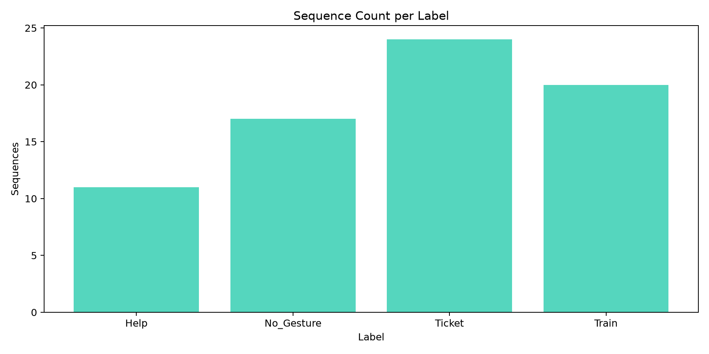

# ISL Dataset Build Report

## Build Summary

- Dataset version: `v2_b8933cbd3e604bb0ae69bb6677af21b8`
- Supersedes version: `none`
- Created at: `2026-09-16T18:46:33.427629+00:00`

| Metric | Value |
| --- | ---: |
| Raw files processed | 97 |
| Total sequences found | 468 |
| Valid before dedup | 303 |
| Removed as duplicates | 231 |
| Valid after dedup | 72 |
| Final after augmentation | 172 |
| Invalid schema rejections | 165 |

## Raw Sources

- `HELP SIGN/isl_dataset_2026-08-10T06-10-01-299Z.json`
- `HELP SIGN/isl_dataset_2026-08-10T06-12-39-815Z.json`
- `HELP SIGN/isl_dataset_2026-08-10T06-13-03-907Z.json`
- `HELP SIGN/isl_dataset_2026-08-10T06-13-39-478Z.json`
- `HELP SIGN/isl_dataset_2026-08-10T06-14-10-150Z.json`
- `HELP SIGN/isl_dataset_2026-08-10T06-16-26-835Z.json`
- `HELP SIGN/isl_dataset_2026-08-10T06-18-00-535Z.json`
- `HELP SIGN/isl_dataset_2026-08-10T06-20-08-311Z.json`
- `HELP SIGN/isl_dataset_2026-08-10T06-21-02-457Z.json`
- `HELP SIGN/isl_dataset_2026-08-10T06-22-16-470Z.json`
- `HELP SIGN/isl_dataset_2026-08-10T06-22-44-502Z.json`
- `HELP SIGN/isl_dataset_2026-08-10T06-26-28-361Z.json`
- `HELP SIGN/isl_dataset_2026-08-10T06-32-37-584Z.json`
- `HELP SIGN/isl_dataset_2026-08-10T06-33-10-691Z.json`
- `HELP SIGN/isl_dataset_2026-08-10T06-52-47-117Z.json`
- `HELP SIGN/isl_dataset_2026-08-10T06-52-54-924Z.json`
- `HELP SIGN/isl_dataset_2026-08-10T06-53-06-179Z.json`
- `HELP SIGN/isl_dataset_2026-08-10T06-54-31-122Z.json`
- `HELP SIGN/isl_dataset_2026-08-11T17-38-23-738Z.json`
- `HELP SIGN/isl_dataset_2026-08-11T17-38-34-798Z.json`
- `HELP SIGN/isl_dataset_2026-08-11T17-38-46-201Z.json`
- `HELP SIGN/isl_dataset_2026-08-11T18-52-48-996Z.json`
- `HELP SIGN/isl_dataset_2026-08-11T18-53-06-448Z.json`
- `HELP SIGN/isl_dataset_2026-08-11T18-53-21-551Z.json`
- `HELP SIGN/isl_dataset_2026-08-11T18-53-32-537Z.json`
- `NO_GESTURE_HAND_SIGN/isl_dataset_2026-09-15T07-44-59-346Z.json`
- `NO_GESTURE_HAND_SIGN/isl_dataset_2026-09-15T07-45-45-353Z.json`
- `NO_GESTURE_HAND_SIGN/isl_dataset_2026-09-15T07-46-03-747Z.json`
- `NO_GESTURE_HAND_SIGN/isl_dataset_2026-09-15T07-46-19-762Z.json`
- `NO_GESTURE_HAND_SIGN/isl_dataset_2026-09-15T07-46-33-303Z.json`
- `NO_GESTURE_HAND_SIGN/isl_dataset_2026-09-15T07-47-11-591Z.json`
- `NO_GESTURE_HAND_SIGN/isl_dataset_2026-09-15T07-47-22-000Z.json`
- `NO_GESTURE_HAND_SIGN/isl_dataset_2026-09-15T07-47-40-304Z.json`
- `NO_GESTURE_HAND_SIGN/isl_dataset_2026-09-15T07-48-42-093Z.json`
- `NO_GESTURE_HAND_SIGN/isl_dataset_2026-09-15T07-48-59-519Z.json`
- `NO_GESTURE_HAND_SIGN/isl_dataset_2026-09-15T07-49-14-173Z.json`
- `NO_GESTURE_HAND_SIGN/isl_dataset_2026-09-15T07-49-30-266Z.json`
- `NO_GESTURE_HAND_SIGN/isl_dataset_2026-09-15T07-49-46-345Z.json`
- `NO_GESTURE_HAND_SIGN/isl_dataset_2026-09-15T07-50-48-888Z.json`
- `NO_GESTURE_HAND_SIGN/isl_dataset_2026-09-15T07-51-09-359Z.json`
- `NO_GESTURE_HAND_SIGN/isl_dataset_2026-09-15T07-51-23-158Z.json`
- `NO_GESTURE_HAND_SIGN/isl_dataset_2026-09-15T07-51-40-538Z.json`
- `NO_GESTURE_HAND_SIGN/isl_dataset_2026-09-15T07-52-15-592Z.json`
- `NO_GESTURE_HAND_SIGN/isl_dataset_2026-09-15T07-52-32-838Z.json`
- `NO_GESTURE_HAND_SIGN/isl_dataset_2026-09-15T07-52-54-263Z.json`
- `NO_GESTURE_HAND_SIGN/isl_dataset_2026-09-15T07-55-06-407Z.json`
- `NO_GESTURE_HAND_SIGN/isl_dataset_2026-09-15T07-55-30-796Z.json`
- `TICKET_HAND_SIGN/isl_dataset_2026-08-18T04-53-03-200Z.json`
- `TICKET_HAND_SIGN/isl_dataset_2026-08-18T04-54-03-958Z.json`
- `TICKET_HAND_SIGN/isl_dataset_2026-08-18T04-54-17-099Z.json`
- `TICKET_HAND_SIGN/isl_dataset_2026-08-18T04-54-32-755Z.json`
- `TICKET_HAND_SIGN/isl_dataset_2026-08-18T04-54-47-611Z.json`
- `TICKET_HAND_SIGN/isl_dataset_2026-08-18T04-55-12-548Z.json`
- `TICKET_HAND_SIGN/isl_dataset_2026-08-18T04-55-39-523Z.json`
- `TICKET_HAND_SIGN/isl_dataset_2026-08-18T04-56-02-205Z.json`
- `TICKET_HAND_SIGN/isl_dataset_2026-08-18T04-56-23-404Z.json`
- `TICKET_HAND_SIGN/isl_dataset_2026-08-18T04-57-12-626Z.json`
- `TICKET_HAND_SIGN/isl_dataset_2026-08-18T04-57-29-263Z.json`
- `TICKET_HAND_SIGN/isl_dataset_2026-08-18T04-58-30-032Z.json`
- `TICKET_HAND_SIGN/isl_dataset_2026-08-18T04-58-44-669Z.json`
- `TICKET_HAND_SIGN/isl_dataset_2026-08-18T04-59-01-387Z.json`
- `TICKET_HAND_SIGN/isl_dataset_2026-08-18T04-59-57-217Z.json`
- `TICKET_HAND_SIGN/isl_dataset_2026-08-18T05-00-45-948Z.json`
- `TICKET_HAND_SIGN/isl_dataset_2026-08-18T05-00-58-268Z.json`
- `TICKET_HAND_SIGN/isl_dataset_2026-08-18T05-01-12-335Z.json`
- `TICKET_HAND_SIGN/isl_dataset_2026-08-18T05-01-53-841Z.json`
- `TICKET_HAND_SIGN/isl_dataset_2026-08-18T05-02-05-282Z.json`
- `TICKET_HAND_SIGN/isl_dataset_2026-08-18T05-02-33-073Z.json`
- `TICKET_HAND_SIGN/isl_dataset_2026-08-18T05-02-54-746Z.json`
- `TICKET_HAND_SIGN/isl_dataset_2026-08-18T05-03-03-260Z.json`
- `TICKET_HAND_SIGN/isl_dataset_2026-08-18T05-03-09-944Z.json`
- `TICKET_HAND_SIGN/isl_dataset_2026-08-18T05-03-17-607Z.json`
- `TRAIN SIGN/isl_dataset_2026-08-13T16-37-50-426Z.json`
- `TRAIN SIGN/isl_dataset_2026-09-16T07-36-52-896Z.json`
- `TRAIN SIGN/isl_dataset_2026-09-16T07-37-16-845Z.json`
- `TRAIN SIGN/isl_dataset_2026-09-16T07-37-27-991Z.json`
- `TRAIN SIGN/isl_dataset_2026-09-16T07-37-38-625Z.json`
- `TRAIN SIGN/isl_dataset_2026-09-16T07-37-56-681Z.json`
- `TRAIN SIGN/isl_dataset_2026-09-16T07-38-16-999Z.json`
- `TRAIN SIGN/isl_dataset_2026-09-16T07-38-27-949Z.json`
- `TRAIN SIGN/isl_dataset_2026-09-16T07-38-37-809Z.json`
- `TRAIN SIGN/isl_dataset_2026-09-16T07-38-48-806Z.json`
- `TRAIN SIGN/isl_dataset_2026-09-16T07-38-59-981Z.json`
- `TRAIN SIGN/isl_dataset_2026-09-16T07-39-16-147Z.json`
- `TRAIN SIGN/isl_dataset_2026-09-16T07-39-41-470Z.json`
- `TRAIN SIGN/isl_dataset_2026-09-16T07-39-50-363Z.json`
- `TRAIN SIGN/isl_dataset_2026-09-16T07-39-59-504Z.json`
- `TRAIN SIGN/isl_dataset_2026-09-16T07-40-08-843Z.json`
- `TRAIN SIGN/isl_dataset_2026-09-16T07-40-18-751Z.json`
- `TRAIN SIGN/isl_dataset_2026-09-16T07-40-35-779Z.json`
- `TRAIN SIGN/isl_dataset_2026-09-16T07-40-50-421Z.json`
- `TRAIN SIGN/isl_dataset_2026-09-16T07-41-00-756Z.json`
- `TRAIN SIGN/isl_dataset_2026-09-16T07-41-12-527Z.json`
- `TRAIN SIGN/isl_dataset_2026-09-16T07-41-31-065Z.json`
- `TRAIN SIGN/isl_dataset_2026-09-16T07-41-43-890Z.json`
- `TRAIN SIGN/isl_dataset_2026-09-16T07-42-04-297Z.json`
- `TRAIN SIGN/isl_dataset_2026-09-16T07-42-37-397Z.json`

## Augmentation

- Enabled: `True`
- Copies per sequence: `2`
- Types: `jitter, timewarp`

## Split Ratio

- Train: `0.7`
- Val: `0.15`
- Test: `0.15`

# Dataset Report

## Label Counts

| Label | Count |
| --- | ---: |
| Help | 11 |
| No_Gesture | 17 |
| Ticket | 24 |
| Train | 20 |

## Per-Person Counts

| Person | Label | Count |
| --- | --- | ---: |
| isl | Help | 11 |
| isl | No_Gesture | 17 |
| isl | Ticket | 24 |
| isl | Train | 20 |

## Minimum Count Check

Minimum required per label: **10**

